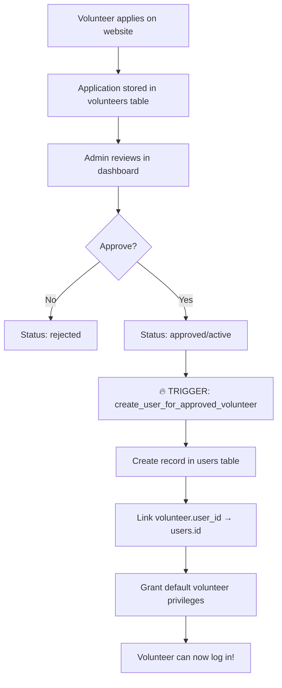
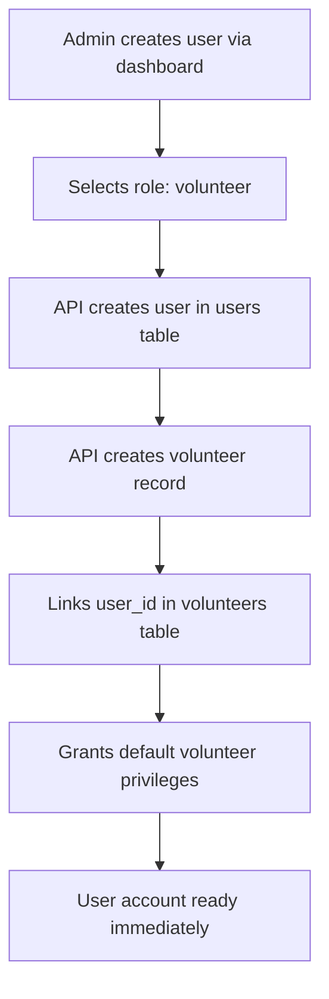
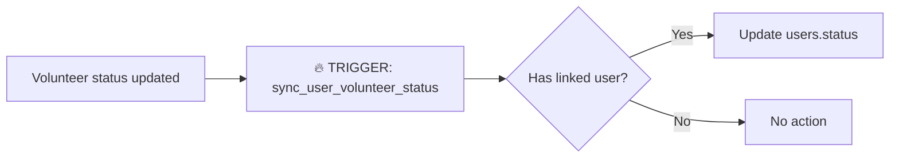

## Unified Users & Volunteer System

**Created**: February 27, 2026
**Status**: ✅ Ready for Implementation

---

## 🎯 Problem Statement

### Current Issues
1. **Disconnected Systems**: Users page stores data in `donors` table, Volunteers page uses `volunteers` table
2. **No User Accounts for Volunteers**: Volunteers can't log in or access a portal
3. **No Role-Based Access**: All users have same permissions
4. **Manual Approval Process**: Approved volunteers don't automatically get user accounts
5. **No Privilege Management**: Can't grant specific permissions to users

### Solution Overview
Complete unified user management system with:
- ✅ Central `users` table linked to Supabase Auth
- ✅ Automatic user account creation when volunteer approved
- ✅ Role-based access control (RBAC)
- ✅ Fine-grained privilege system
- ✅ Automatic sync between users and volunteers
- ✅ Volunteer-specific permissions for portal access

---

## 📊 Architecture

### Database Tables

#### 1. **`users`** (Central registry)
```sql
- id (uuid, PK)
- auth_user_id (uuid, FK to auth.users)
- email (unique)
- name, phone, avatar, location
- role (super_admin, admin, volunteer, donor, user)
- status (active, inactive, suspended, banned)
- verified (boolean)
- created_at, updated_at, last_login
- metadata (jsonb)
```

#### 2. **`volunteers`** (Enhanced)
```sql
- (existing fields)
+ user_id (uuid, FK to users) -- NEW
+ role_id (uuid, FK to volunteer_roles) -- NEW
```

#### 3. **`user_privileges`** (Permissions)
```sql
- id (uuid, PK)
- user_id (FK to users)
- privilege_key (text)
- privilege_value (text, optional)
- granted_by (FK to users)
- granted_at, expires_at
- is_active (boolean)
```

#### 4. **`predefined_privileges`** (Permission definitions)
```sql
- id, key, name, description
- category (content, users, volunteers, donations, etc.)
- default_roles (text[]) -- Auto-grant to these roles
- is_active
```

### User Roles Hierarchy

```
super_admin (Full system access)
    ↓
admin (Manage content, users, volunteers)
    ↓
volunteer (Access volunteer portal, submit hours, view assignments)
    ↓
donor (View donation history, receipts)
    ↓
user (Basic access)
```

### Predefined Volunteer Privileges

| Key | Name | Description | Category |
|-----|------|-------------|----------|
| `volunteer.view_opportunities` | View Volunteer Opportunities | Can view available roles | volunteers |
| `volunteer.apply` | Apply for Roles | Can submit applications | volunteers |
| `volunteer.view_assignments` | View Own Assignments | Can view schedules | volunteers |
| `volunteer.submit_hours` | Submit Hours | Can log volunteer hours | volunteers |
| `volunteer.view_reports` | View Own Reports | Can view activity reports | volunteers |
| `content.view_outreaches` | View Outreaches | Can view outreach programs | content |
| `communications.receive_notifications` | Receive Notifications | Receives notifications | communications |
| `communications.send_messages` | Send Messages | Can message admin team | communications |
| `analytics.view_own` | View Own Analytics | View personal analytics | analytics |

---

## 🔄 Automatic Workflows

### Workflow 1: Volunteer Approval → User Account Creation



**Trigger Details**:
- **When**: Volunteer status changes to 'approved' or 'active'
- **Action**: Automatically creates user account
- **Privileges**: Grants all privileges where `default_roles` contains 'volunteer'
- **Link**: Sets `volunteer.user_id` to new user's ID

### Workflow 2: Admin Creates User with Volunteer Role



### Workflow 3: Status Sync



**Status Mapping**:
- `volunteer: active` → `user: active`
- `volunteer: approved` → `user: active`
- `volunteer: inactive` → `user: inactive`
- `volunteer: rejected` → `user: suspended`

---

## 🚀 Implementation Steps

### Step 1: Run Database Migration

```bash
# Execute in Supabase SQL Editor (in order)
1. volunteer_tables.sql (if not already run)
2. form_options_tables.sql (if not already run)
3. unified_users_system.sql ⭐ NEW
```

**What it does**:
- ✅ Creates `users` table
- ✅ Adds `user_id` and `role_id` to `volunteers` table
- ✅ Creates `user_privileges` table
- ✅ Creates `predefined_privileges` table with 9 volunteer privileges
- ✅ Sets up automatic triggers for user creation and status sync
- ✅ Creates helper functions (`user_has_privilege`, `get_user_role`)
- ✅ Creates view `users_with_volunteer_details` for easy querying
- ✅ Sets up RLS policies for security

### Step 2: (Optional) Migrate Existing Data

Uncomment migration section in `unified_users_system.sql`:

```sql
-- Lines 285-308: Migrate existing volunteers to users table
-- Lines 310-316: Link volunteers to new user records
```

**This will**:
- Create user accounts for all approved/active volunteers
- Link existing volunteer records to new user accounts
- Preserve all existing data

### Step 3: Update Admin Users Page

File: `/pages/admin/users/index.tsx`

**Changes needed**:
```typescript
// OLD: Fetch from donors table
const { data } = await client.from('donors').select('*');

// NEW: Fetch from users table with volunteer details
const { data } = await client
  .from('users')
  .select(`
    *,
    volunteers (
      id, status, interests, skills, role_id,
      volunteer_roles (title, category)
    )
  `);
```

**Update Create User Function**:
```typescript
// Use new /api/admin/users endpoint instead of donors table
const response = await fetch('/api/admin/users', {
  method: 'POST',
  headers: { 'Content-Type': 'application/json', 'Authorization': `Bearer ${token}` },
  body: JSON.stringify({
    email, name, phone, location, role,
    createVolunteerRecord: role === 'volunteer' // Auto-create volunteer record
  })
});
```

### Step 4: Update Volunteers Page (Optional Enhancement)

File: `/pages/admin/users/volunteers.tsx`

**Show linked user accounts**:
```typescript
// Fetch volunteers with user details
const { data } = await client
  .from('volunteers')
  .select(`
    *,
    users (id, email, role, status, last_login)
  `);
```

**Add "Create User Account" button** for volunteers without accounts

### Step 5: Test the System

#### Test 1: Volunteer Approval Flow
1. Go to Volunteers management page
2. Find a volunteer with status "pending"
3. Click "Approve"
4. ✅ Verify user account created in Users page
5. ✅ Verify `user_id` populated in volunteer record
6. ✅ Check privileges granted in `user_privileges` table

#### Test 2: Admin Creates Volunteer User
1. Go to Users management page
2. Click "Add User"
3. Fill form with role = "volunteer"
4. Submit
5. ✅ Verify user created in `users` table
6. ✅ Verify volunteer record created in `volunteers` table
7. ✅ Verify records are linked

#### Test 3: Status Sync
1. Go to Volunteers page
2. Change volunteer status from "active" to "inactive"
3. ✅ Verify user status also changed to "inactive"

#### Test 4: Privilege Check
```sql
-- Check if user has specific privilege
SELECT user_has_privilege(
  'user-uuid-here',
  'volunteer.submit_hours'
);
-- Should return true for volunteers
```

---

## 🔐 Security Features

### 1. Row Level Security (RLS)
- **Users can**:
  - View their own profile
  - Update their own profile (except role/status)
- **Admins can**:
  - View all users
  - Manage all users
  - Grant/revoke privileges

### 2. Authentication Integration
- Links to Supabase Auth via `auth_user_id`
- Supports SSO and email/password authentication
- Secure session management

### 3. Privilege System
- Fine-grained permissions
- Role-based defaults
- Time-limited privileges (expires_at)
- Audit trail (granted_by, granted_at)

### 4. Cascading Deletes
- Deleting user → Deletes privileges
- Soft delete by default (set status = inactive)
- Preserves data integrity

---

## 📡 API Endpoints

### `/api/admin/users` ⭐ NEW

#### GET - List Users
```http
GET /api/admin/users?role=volunteer&status=active&search=john
Authorization: Bearer {token}
```

**Response**:
```json
{
  "success": true,
  "data": [
    {
      "id": "uuid",
      "email": "john@example.com",
      "name": "John Doe",
      "role": "volunteer",
      "status": "active",
      "verified": true,
      "volunteers": [
        {
          "id": "uuid",
          "status": "active",
          "interests": ["Medical", "Education"],
          "volunteer_roles": {
            "title": "Medical Volunteer"
          }
        }
      ]
    }
  ]
}
```

#### POST - Create User
```http
POST /api/admin/users
Authorization: Bearer {token}
Content-Type: application/json

{
  "email": "jane@example.com",
  "name": "Jane Smith",
  "phone": "+234 801 234 5678",
  "location": "Lagos, Nigeria",
  "role": "volunteer",
  "createVolunteerRecord": true
}
```

**Response**:
```json
{
  "success": true,
  "data": {
    "id": "uuid",
    "email": "jane@example.com",
    "role": "volunteer",
    "status": "active"
  },
  "message": "User created successfully"
}
```

#### PUT - Update User
```http
PUT /api/admin/users
Authorization: Bearer {token}
Content-Type: application/json

{
  "userId": "uuid",
  "name": "Jane Doe",
  "status": "inactive"
}
```

#### DELETE - Deactivate User
```http
DELETE /api/admin/users?userId=uuid
Authorization: Bearer {token}
```

---

## 🎨 Volunteer Portal (Future Enhancement)

### Portal Features (To Be Built)
1. **Dashboard**
   - Welcome message with user name
   - Quick stats (hours logged, events attended)
   - Upcoming assignments

2. **My Assignments**
   - View assigned volunteer roles
   - See schedules and locations
   - Mark attendance

3. **Time Logging**
   - Submit volunteer hours
   - Add activity descriptions
   - Upload photos/evidence

4. **Opportunities**
   - Browse available volunteer roles
   - Apply for new roles
   - Track application status

5. **My Profile**
   - Update contact information
   - Manage availability
   - Update skills and interests

6. **Reports & Analytics**
   - View contribution history
   - Download service certificates
   - See impact metrics

### Portal Routes
```
/volunteer-portal (requires auth, role: volunteer)
  ├── /volunteer-portal/dashboard
  ├── /volunteer-portal/assignments
  ├── /volunteer-portal/hours
  ├── /volunteer-portal/opportunities
  ├── /volunteer-portal/profile
  └── /volunteer-portal/reports
```

---

## 🧪 Testing Checklist

### Database
- [ ] Run `unified_users_system.sql` successfully
- [ ] Verify `users` table created
- [ ] Verify `user_privileges` table created
- [ ] Verify `predefined_privileges` table has 9 records
- [ ] Verify triggers created
- [ ] Test RLS policies (public cannot access users table)

### Volunteer Approval Workflow
- [ ] Approve volunteer with status "pending"
- [ ] Verify user record created automatically
- [ ] Verify `volunteer.user_id` populated
- [ ] Verify privileges granted (9 default privileges)
- [ ] Check user can log in (if auth set up)

### Admin User Creation
- [ ] Create user via `/api/admin/users` with role="volunteer"
- [ ] Verify user created in `users` table
- [ ] Verify volunteer record created and linked
- [ ] Verify privileges granted

### Status Sync
- [ ] Update volunteer status to "inactive"
- [ ] Verify user status updated to "inactive"
- [ ] Update volunteer status to "active"
- [ ] Verify user status updated to "active"

### Privilege System
- [ ] Query `user_privileges` table for a volunteer user
- [ ] Verify 9 privileges present
- [ ] Test `user_has_privilege()` function
- [ ] Grant custom privilege via admin
- [ ] Revoke privilege

### API Endpoints
- [ ] GET /api/admin/users - List all users
- [ ] GET /api/admin/users?role=volunteer - Filter by role
- [ ] GET /api/admin/users?search=john - Search users
- [ ] POST /api/admin/users - Create new user
- [ ] PUT /api/admin/users - Update user
- [ ] DELETE /api/admin/users - Deactivate user

---

## ⚙️ Configuration

### Environment Variables
```env
# No new env variables required
# Uses existing Supabase credentials
NEXT_PUBLIC_SUPABASE_URL=your_url
NEXT_PUBLIC_SUPABASE_ANON_KEY=your_anon_key
SUPABASE_SERVICE_ROLE_KEY=your_service_key
```

### Admin Role Assignment
To make a user an admin:
```sql
UPDATE users
SET role = 'admin'
WHERE email = 'admin@example.com';
```

To make a user a super admin:
```sql
UPDATE users
SET role = 'super_admin'
WHERE email = 'superadmin@example.com';
```

---

## 📚 Helper Functions

### Check User Privilege
```sql
SELECT user_has_privilege(
  'user-uuid',
  'volunteer.submit_hours'
);
-- Returns: true/false
```

### Get User Role
```sql
SELECT get_user_role('auth-user-uuid');
-- Returns: 'volunteer', 'admin', etc.
```

### View User with Volunteer Details
```sql
SELECT * FROM users_with_volunteer_details
WHERE user_status = 'active';
```

---

## 🔄 Migration from Old System

### Before Migration
- **Users page**: Queries `donors` table
- **Volunteers page**: Queries `volunteers` table
- **No link between them**

### After Migration
- **Users page**: Queries `users` table (with volunteer details joined)
- **Volunteers page**: Queries `volunteers` table (with user details joined)
- **Automatic sync**: Changes in volunteers → Update users and vice versa

### Breaking Changes
⚠️ **Admin Users Page needs updating** to use new `/api/admin/users` endpoint instead of querying `donors` directly.

---

## 🎯 Benefits

### For Admins
- ✅ Single source of truth for all users
- ✅ Automatic user account creation for volunteers
- ✅ Centralized permission management
- ✅ No manual setup for approved volunteers

### For Volunteers
- ✅ Automatic account creation on approval
- ✅ Can log in to volunteer portal (future)
- ✅ Personalized dashboard and analytics
- ✅ Self-service profile management

### For Developers
- ✅ Clean data architecture
- ✅ Built-in security with RLS
- ✅ Extensible privilege system
- ✅ Easy to add new user roles

---

## 📝 Next Steps

1. **Run database migration** (`unified_users_system.sql`)
2. **Test volunteer approval workflow** (approve a pending volunteer)
3. **Update admin users page** to use new API
4. **Build volunteer portal** (Phase 2)
5. **Add privilege management UI** for admins
6. **Implement authentication** for volunteer logins

---

## 🆘 Troubleshooting

### Issue: Trigger not creating user
**Check**:
1. Volunteer status changed to 'approved' or 'active'
2. Volunteer email is valid
3. No existing user with same email

**Debug**:
```sql
-- Check trigger exists
SELECT * FROM pg_trigger WHERE tgname = 'trigger_create_user_for_volunteer';

-- Check function exists
SELECT * FROM pg_proc WHERE proname = 'create_user_for_approved_volunteer';
```

### Issue: Privileges not granted
**Check**:
1. User role is 'volunteer'
2. Predefined privileges exist
3. `default_roles` array contains 'volunteer'

**Debug**:
```sql
-- Check predefined privileges
SELECT * FROM predefined_privileges WHERE 'volunteer' = ANY(default_roles);

-- Manually grant privilege
INSERT INTO user_privileges (user_id, privilege_key, is_active)
VALUES ('user-uuid', 'volunteer.view_opportunities', true);
```

### Issue: RLS blocking admin access
**Solution**: Use service role key in API endpoints (already implemented in `/api/admin/users.ts`)

---

**Last Updated**: February 27, 2026
**Author**: Claude Code Assistant
**Status**: Ready for Implementation 🚀
